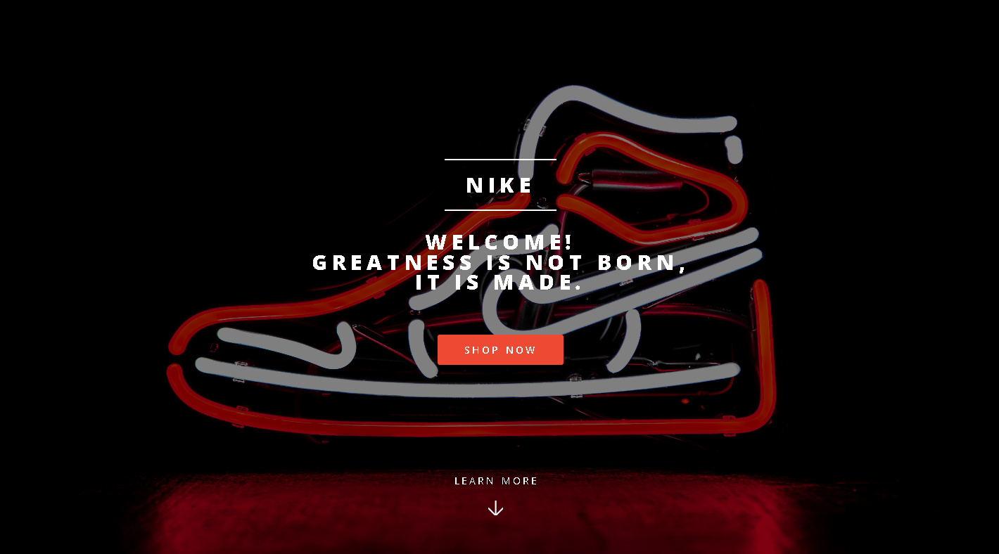
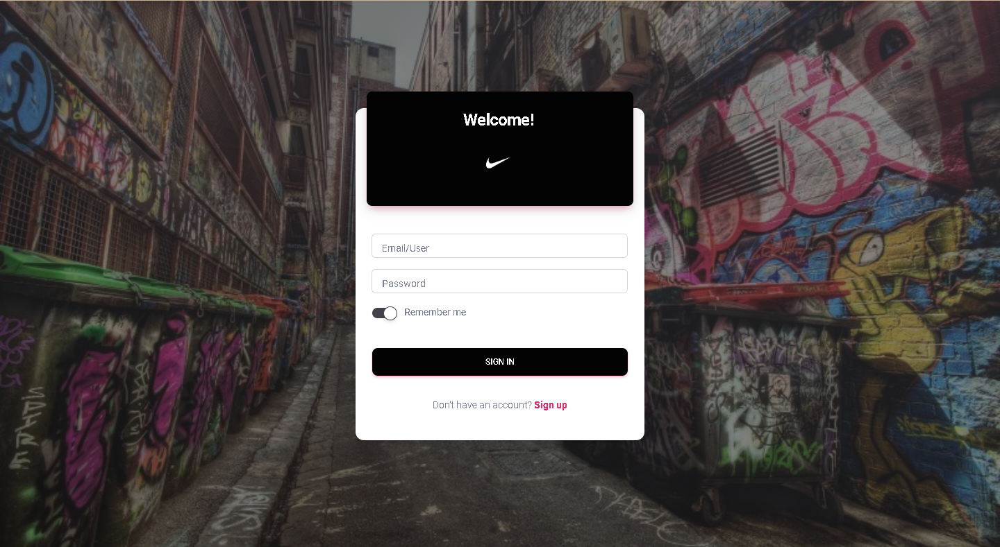
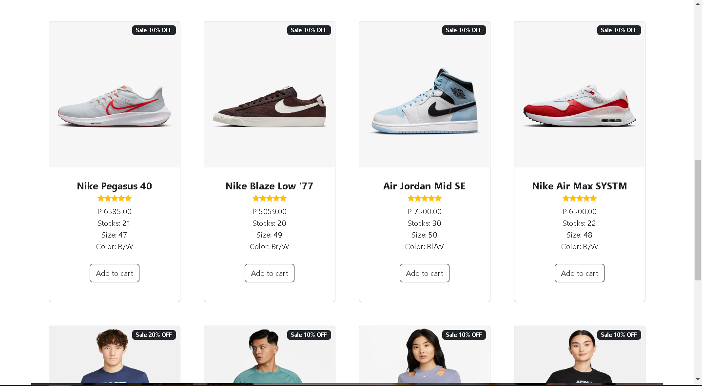
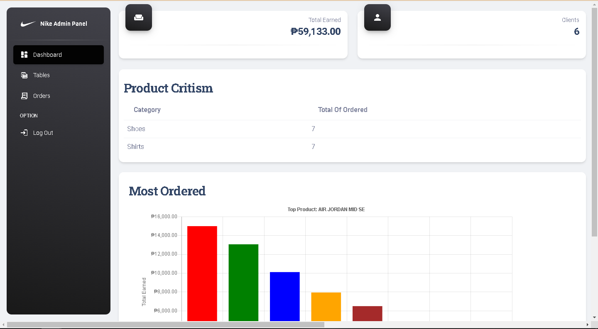

## USER SHOPPING CART AND ORDER SYSTEM

</a>
</a>
</a>
</a>

<h2> System Features </h2>

**Introduction Page**
  - Page that shows the details about the example company.

**Sign in and Out Page**
  - Page to log in the users and admin.

**Cart System User's Page**
  - Page that users can create order.

**Dashboard of Admin**
  - Consist of tables and graphs about the sales from the users.
  - Sale's Calculation
  - Vertical Graph for the Sales
  - Count of Number of Clients
    
    **CRUD** - The system has CRUD features:
      - Create - The user can create order from the User's page. Admin can add item/product.
      - Read - The user can view the data of product from the user's page. Admin can view system's data from the admin dashboard page.
      - Update - The admin can update/edit system's data from the dashboard page.
      - Delete - The admin can delete/cancel orders of the users.

## Visuals

*The image above shows the index Page*

   

*The image above shows the index Down Page*

   

*The image above shows the Sign-in Page*

   

*The image above shows the User's Cart Page*

   

*The image above shows the User's Cart Down Page*

   

*The image above shows the Sign-in Page*

   

# Installation

1. Fork the Repository
2. Import the nike.sql database using MySQL
3. Edit the db file in the config folder using VSCode
4. Open Wampserver or xamppserver
5. Run the App using the Wampserver or xamppserver's adminer
6. Enjoy the App

### Requirement:

- [Wampserver](https://www.wampserver.com/en/download-wampserver-64bits/) or [xamppserver](https://www.apachefriends.org) - for running PHP and MySQL

1. Download Wampserver or xamppserver from the provided link
2. Run the installer
3. Follow the installation guide from the installer
4. Finish the installation

  

- [PHP](https://www.php.net/downloads) - for using the PHP Programming Language

1. Download PHP from the provided Link
2. Extract the downloaded file
3. Copy the Extracted File's Path from the File Explorer's Address Bar
4. Open the System Environment Variables in the Control Panel and Edit it
5. Click Path and Edit
6. Click New then add the Extracted File's Path then press Ok
7. Open Command Prompt and type php --version to confirm the installation

  

- [MySQL](https://www.mysql.com/downloads/) - For Creating and Editing Database

1. Download MySQL Installer from the provided link
2. Run the installer and Accept License Agreement
3. Select Developer's Default or Full on Setup Type then click Next
4. Select all the Products and Features then click Next
5. click Execute to Download and Install Selected Products and Features then Click Next
6. Select Standalone MySQL Server then click Next
7. Select Development Computer in Config Type then click Next
8. Select "Use Strong Password Encryption for Authentication" in Authentication Method then click Next
9. Type a Password for the root user then click Next
10. Leave the Window Service into default then click Next
11. Execute the Apply Configuration then Click Next
12. Finish the Installation

   

- [VSCode](https://code.visualstudio.com) - for Coding

1. Download the VSCode Installer from the provided Link
2. Run the Installer 
3. Accept the License Agreement then click Next
4. Select a File Destination Locartion then click Next
5. Select a Start Menu Folder then Click Next
6. Select Additional Tasks then Click Next
7. Click Install and Wait for it to finish
8. Finish the Installation

   

# Usage

- **User's Order System** 
- **Sales Tracking** 
- **Transaction Tracking**

# Support

For Questions and Further Assistance, you can Contact us using

- Hector A. Herrera Jr. - 201140489@psu.palawan.edu.ph
- Ehd Steven V. Jaranilla

   

# Authors and Acknowledgements

## [Hector A. Herrera](https://github.com/hexzanity)

   

# License 

**MIT License**

Copyright (c) [2023] [Hector A. Herrera Jr.]

DO NOT COPY THIS FOR FUNNY PURPOSES

